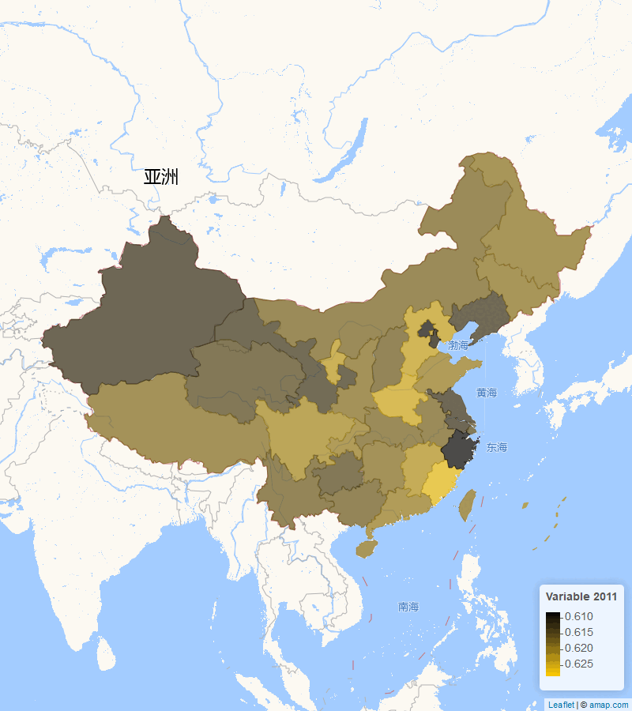
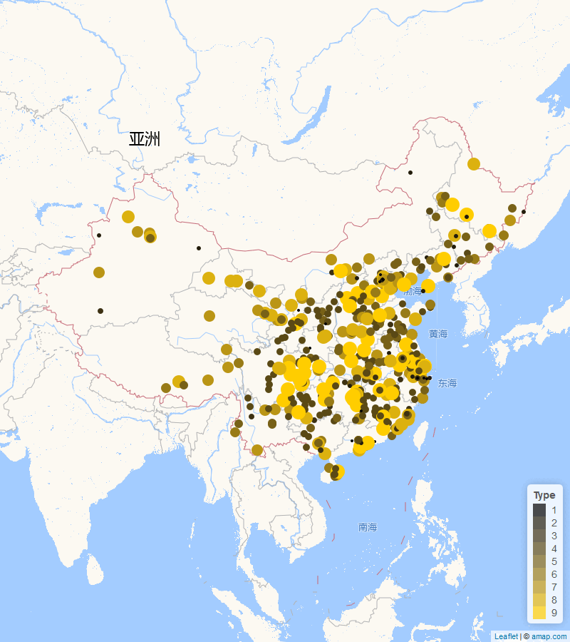

```{r setup, include=FALSE}
knitr::opts_chunk$set(
  message = FALSE,
  warning = FALSE
  # dpi = 300,
  # fig.dim = c(2.2, 2.5)
)

if(!require(dir2json)) remotes::install_github("stla/dir2json")

library(ggplot2)
library(dir2json)
library(drhutools)

# Functions preload
theme_set(theme_minimal())
set.seed(313)
```


# Efficient file organization: `folderSystem`

An efficient folder system can produce an organized environment for research and a smooth flow to pick up what you left from another moment. 
`folderSystem` provides a consistent folder categorization for a research project, especially, of empirical studies in social science. 

Once the function is called, it will create the folders shown as following in the working directory. 
In each folder, there is a short document indicating what it is suggested to be used.
Users are free to remove this illustration document after locating the real files in.
If the folders with the same name already exist in the directory, it would not be recreated or overwritten.

```{r foldersystem_setup, include=FALSE}
library(drhutools)

wd_original <- getwd()

# Create a temporary directory
temp_dir <- tempfile() 
dir.create(temp_dir)
setwd(temp_dir)

folderSystem()
```

```{r folderSystem, eval=FALSE}
folderSystem()
```


```{r folderSystem_tree, echo=FALSE}
# Show the dendrogram of the folder structure using dir2tree
dir2tree(temp_dir) |> 
  cat()
```

```{r folderSystem_resetwd, include=FALSE}
setwd(wd_original)
```

# Psychological scale scoring: `traits`

`traits` is used for calculating personality traits based on psychological surveys.
The current version can calculate the TOSCA-3SC scores and Grit-O score.
The TOSCA-3SC (Test of Self-Conscious Affect—Short Version) is created by @Tangney1990 for measuring self-conscious emotions, particularly *shame* and *guilt* []. 
Participants are presented with hypothetical scenarios, and their responses are analyzed to assess the intensity of shame or guilt reactions. 
The Grit-O scale is created by @DuckworthEtAl2007 to measure *grit*, which refers to an individual's perseverance and passion for long-term goals.

Users need to fit the survey data with specific column names as illustrated below: 

- TOSCA-3SC: `Q3|R3` ~ `Q13|R4`
- Grit-O: `Q14|1` ~ `Q25|1`

```{r traits}
column_names <- c("Q3|R3", "Q3|R4", "Q4|R3", "Q4|R4", "Q5|R5", "Q5|R6", "Q6|R3", "Q6|R4", "Q7|R3", 
"Q7|R4", "Q8|R5", "Q8|R6", "Q9|R5", "Q9|R6", "Q10|R5", "Q10|R6", "Q11|R5", "Q11|R6", "Q12|R3", 
"Q12|R4", "Q13|R3", "Q13|R4", "Q14|1", "Q15|1", "Q16|1", "Q17|1", "Q18|1", "Q19|1", "Q20|1", 
"Q21|1", "Q22|1", "Q23|1", "Q24|1", "Q25|1")

toy_data <- data.frame(matrix(sample(1:5, 10 * length(column_names), replace = TRUE), 
ncol = length(column_names)))

names(toy_data) <- column_names

traits(toy_data)
```


# Experimental result visulaization: `cdplot`

`cdplot` provides a function to compare the empirical cumulative distribution functions (ECDF) between the treatment and control groups in an experiment or quasi-experiment.
Comparing with conventional bar plots or difference-in-mean statistics, ECDF offers a fuller, non-parametric picture of the difference between treatment and control groups. 

The function will produce a `ggplot` object showing the entire distribution between the experimental groups.
The plot will show the ECDF of both the control and treatment groups.
It also identify with points and dash lines the value at which the treatment group is different from the control the most.
For multi-group experiment, the function will produce multiple plots for the comparison between the control group and each treatment.

Users should put experimental data into a "long" format storing the outcome in the first column and assignment in the second column.
The assign groups should be stored as levels of a factor.
The first category will be regarded as the control group.


Users can alter the argument in `point_size`, `point_color`, and `link_color` to customize the size of points and lines in the plot.
The function also provide the Kolmogorov-Smirnov test result between the control and treatment groups.
Users can set `ks_test` to `TRUE` to appear the result at the bottom-right corner of the plot.

The following example illustrates the results of an  experiment to compare yields (as measured by dried weight of plants) obtained under a control and two different treatment conditions, a dataset from @Dobson1983 and freely access by `datasets::PlantGrowh`.


```{r cdplot}
data("PlantGrowth")

plot_plant <- cdplot(PlantGrowth, ks_test = TRUE)
plot_plant
```


# Standard Map of China: `goodmap`

Using map is not only a visualization but political issue for Chinese scolars. 
The `goodmap` function is designed to draw national maps based on the template released by [Amap.com](https://ditu.amap.com/?amapexchange=%2F) (高德地图).
We were inspired by Dawei Lang's ([Lchiffon](https://github.com/Lchiffon)) excellent package [`leafletCN`](https://github.com/Lchiffon/leafletCN) and optimize `leafletCN::geojsonMap` to concentrate on drawing national maps. 
Moreover, we adopted [Yang Cao](https://caoyang.tech/)'s geodata [updated](https://github.com/Lchiffon/leafletCN/issues/12) in 2020 when drawing the map. 

The current version of `goodmap` enables users to draw points or fill polygons based on full names of prefectures or provinces, as illustrated in the following example.
For data does not have full city or provincial names, users can consider use tools such as [`regioncodes`](https://cran.r-project.org/web/packages/regioncode/index.html) to convert the data to the required format.

```{r}
default_locate <- Sys.getlocale(category = "LC_CTYPE")

if(!(default_locate == "English_United States.utf8"))
  Sys.setlocale(category = "LC_CTYPE", locate = "en_US.UTF-8")
```


```{r}
toy_map <- data.frame(
  id = c(1, 2, 3, 4, 5, 6),
  city = c("乌鲁木齐", "拉萨", "呼和浩特", "西宁", "成都", "哈尔滨"),
  prov = c("新疆维吾尔自治区", "西藏自治区", "内蒙古自治区", "青海省", "四川省", "黑龙江省"),
  year_set = c(2010, 2010, 2010, 2011, 2011, 2011),
  variable = c(0.2861395, 0.3881083, 0.9466682, 0.8360043, 0.4622928, 0.1387102)
)
```


```{r}
toy_map2010 <- toy_map[, toy_map$year_set == 2010]

goodmap(toy_map2010, type = "polygon", level = "province")

goodmap(toy_map2010, type = "polygon", level = "province", animate = TRUE, animate_var = "year", years = c(2011, 2012))
```


If the map type is `polygon`, the dataframe should follow the structure below:

| id | city       | prov               | year_set | variable   |
|----|------------|--------------------|----------|------------|
| 1  | 乌鲁木齐  | 新疆维吾尔自治区    | 2010     | 0.2861395  |
| 2  | 拉萨      | 西藏自治区          | 2010     | 0.3881083  |
| 3  | 呼和浩特  | 内蒙古自治区        | 2010     | 0.9466682  |
| 4  | 西宁      | 青海省              | 2011     | 0.8360043  |
| 5  | 成都      | 四川省              | 2011     | 0.4622928  |
| 6  | 哈尔滨    | 黑龙江省            | 2011     | 0.1387102  |

Before loading this function, please set the environment language:

```{r, eval = FALSE}
Sys.setlocale(category = "LC_CTYPE", locate = "en_US.UTF-8")

#Run the function with the data file:

goodmap(data_file, type = "polygon", level = "province", animate = TRUE, animate_var = "year", years = c(2011, 2012))
```

The function returns the file path of the saved map image. The map is also saved as an HTML file for interactive viewing.

### Figure: Animation for 2011 and 2012
```{r out.width = '70%', echo = FALSE}

```

## Example for Point Type

If the map type is `point`, the dataframe should follow the structure below:

| name                      | year_set | g_lat   | g_lon    | g_pro  | g_city  | type |
|---------------------------|----------|---------|----------|--------|---------|------|
| 中国共产党历史展览馆      | 2021     | 40.00379| 116.3994 | 北京市 | 北京市  | 7    |
| 中央礼品文物管理中心      | 2021     | 39.89785| 116.4109 | 北京市 | 北京市  | 7    |
| 中国美术馆                | 2021     | 39.92535| 116.4090 | 北京市 | 北京市  | 8    |
| 中国电影博物馆            | 2021     | 39.99636| 116.5206 | 北京市 | 北京市  | 8    |
| 中国邮政邮票博物馆        | 2021     | 39.91081| 116.4311 | 北京市 | 北京市  | 8    |
| 中国钱币博物馆            | 2021     | 39.90215| 116.3949 | 北京市 | 北京市  | 8    |

Before loading this function, please set the environment language:

```{r, eval = FALSE}
Sys.setlocale("LC_CTYPE", "en_US.UTF-8")

#Run the function with the data file:

goodmap(data_file, type = "point", animate = TRUE, animate_var = "year", years = c(1997, 2001, 2005, 2009, 2017, 2019, 2021)
```

The function returns the file path of the saved maps GIF. The map is also saved as an HTML file for interactive viewing.

### Figure: Animation for 1997, 2001, 2005, 2009, 2017, 2019, 2021
```{r out.width = '70%', echo = FALSE}

```

# Color blind friendly palette

Everyone has their favorite colors. 
This package provides a palette that I personally like and use all the time. 
The primary colors are gold (#FFCD00) and black (#000000).
So the palette is named as `_gb`. 

Users can use the palette as any other palettes when visualizing with `ggplot2`.
All the above visualizing elements are drawn with this palette. 
An extra example with codes are shown below to illustrate how users can use it.

```{r gb}
ggplot(mtcars, aes(wt, mpg, color = cyl)) + 
  geom_point() +
  scale_color_gb(discrete = FALSE)

ggplot(mpg, aes(y = class, fill = drv)) + 
  geom_bar() +
  scale_fill_gb()
```

Except for the primary palette (named as `main`), users are given four alternatives with more color options, as following.

- `tricol`: Gold, black, and dark grey to create a gradual effect.
- `digitMixed`: Five-pack colors specified for digital publications.
- `printMixed`: Five-pack colors specified for printed publications.
- `full`: A palette including all the colors gb_cols can call.

I would actually like to open this function to my users for adding your favorite palette, as long as you give them a special name and a list of colors.

# Affiliation

Yue Hu

Department of Political Science,

Tsinghua University, 

Email: <yuehu@tsinghua.edu.cn>

Website: <https://www.drhuyue.site>

<br>

Wen Deng

College of Public Administration,

Huazhong University of Science and Technology,

Email: <dengwenjoy@outlook.com>

## References
