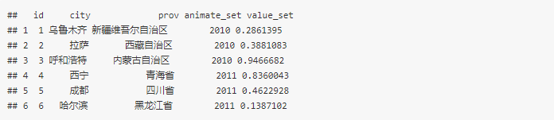
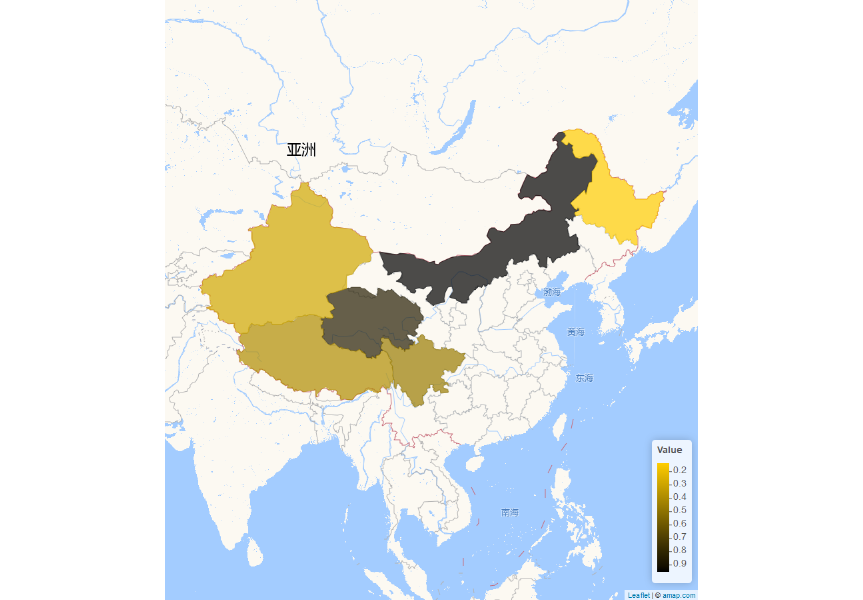
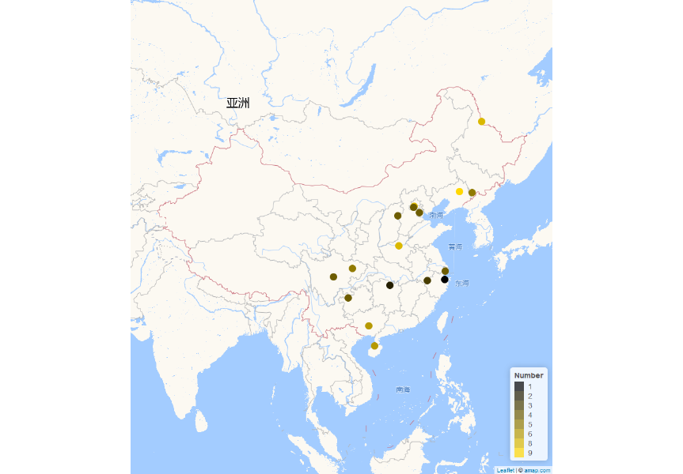

```{r setup, include=FALSE}
knitr::opts_chunk$set(
  message = FALSE,
  warning = FALSE
  # dpi = 300,
  # fig.dim = c(2.2, 2.5)
)

library(ggplot2)
library(drhutools)

# Functions preload
theme_set(theme_minimal())
set.seed(313)
```

The `drhutools` package is designed to support political science research and academic tasks by providing a set of practical tools. 
The functions are developed to streamline routine data analysis and visualization while accommodating domain-specific requirements.

# Installation

You can install the stable version of `drhutools` from CRAN or the developed version from GitHub using the following commands:

```{r install-drhutools, eval=FALSE}
# Install the stable version
install.packages("drhutools")

# Install drhutools from GitHub
remotes::install_github("yuedeng/drhutools")
```

# Efficient File Organization with `folderSystem`

A well-organized folder system enhances research efficiency and ensures continuity, allowing you to easily resume work at any stage of the project. 
The `folderSystem` function establishes a standardized folder structure tailored for research projects, particularly those involving empirical studies in social science.

```{r folderSystem, eval=FALSE}
library(drhutools)

folderSystem()
```

When the function is executed, it creates the following folder structure in the working directory. 
Each folder includes a brief guide explaining its recommended usage. Users may delete these instructional files once they have organized their actual project files. 
If folders with the same names already exist in the directory, the function will not recreate or overwrite them, ensuring no accidental loss of existing data.

```txt
## +- paper
## |  |
## |  +- submission
## |  |  |
## |  |  `- files for submission here; delete this file after locating the real files here.txt
## |  |
## |  `- images
## |     |
## |     `- non-code-generated images here; delete this file after locating the real files.txt
## |
## +- output
## |  |
## |  `- image, results, and other output files here; delete this file after locating the real files here.txt
## |
## +- document
## |  |
## |  `- documents and materials here; delete this file after locating the real files.txt
## |
## +- data
## |  |
## |  `- all data file here.csv
## |
## `- codes
##    |
##    `- put codes here; delete this file after locating the real files.txt
```

# Visualizing Experimental Results with `cdplot`

`cdplot` enables the comparison of empirical cumulative distribution functions (ECDFs) between treatment and control groups in experiments or quasi-experiments. 
Unlike conventional bar plots or difference-in-mean statistics, ECDFs provide a comprehensive, non-parametric view of differences between the treatment and control groups, capturing the entire distribution of outcomes.

The function generates a `ggplot` object that displays:

1. The ECDFs of the control and treatment groups.
2. Points and dashed lines highlighting the value at which the treatment group differs most from the control group.
3. For multi-group experiments, separate plots comparing the control group to each treatment group.

Before using `cdplot`, the users should organize the experimental data in a "long" format, where the first column contains the outcome variable.
The second column contains the group assignment, stored as a factor with levels.
The first level is treated as the control group.

```{r cdplot}
data("PlantGrowth")

plot_plant <- cdplot(PlantGrowth, ks_test = TRUE)
plot_plant
```

Users can customize the appearance of the plot by adjusting:
- `point_size` to control the size of the points.
- `point_color` to define the color of the points.
- `link_color` to set the color of the dashed lines.

Additionally, the function can perform and display the results of a Kolmogorov-Smirnov (K-S) test to compare the distributions. Set the `ks_test` argument to `TRUE` to show the test result in the bottom-right corner of the plot.


# Color-Blind Friendly Palette

While everyone has their preferred colors, this package includes a palette that I personally use and recommend. The primary colors are gold (`#FFCD00`) and black (`#000000`), which inspired the name `_gb`.

This palette integrates seamlessly with `ggplot2` visualizations, allowing users to apply it as they would any other palette. The visualizations shown above were created using this palette. Below is an additional example demonstrating how to use it in practice:

```{r gb}
ggplot(mtcars, aes(wt, mpg, color = cyl)) +
  geom_point() +
  scale_color_gb(discrete = FALSE)

ggplot(mpg, aes(y = class, fill = drv)) +
  geom_bar() +
  scale_fill_gb()
```

In addition to the primary palette (`main`), the package offers four alternatives to suit various visualization needs:

- `tricol`: A gradient effect using gold, black, and dark grey.
- `digitMixed`: A set of five colors optimized for digital publications.
- `printMixed`: A set of five colors optimized for printed materials.
- `full`: A comprehensive palette containing all colors available through `gb_cols`.

I also invite users to contribute their favorite palettes. You can customize and add your own palette by assigning it a unique name and providing a list of colors.


# Standard Map of China: `goodmap`

Drawing maps can often be a challenge for Chinese scholars. 
The `goodmap` function simplifies this process by creating national maps based on a template provided by [Amap.com](https://ditu.amap.com/?amapexchange=%2F). 
This function is inspired by Dawei Lang's excellent package [`leafletCN`](https://github.com/Lchiffon/leafletCN) and optimizes `leafletCN::geojsonMap` to focus specifically on national maps. It also incorporates geodata updated in 2020 by [Yang Cao](https://caoyang.tech/) ([details here](https://github.com/Lchiffon/leafletCN/issues/12)).

## Static Maps

The current version of `goodmap` allows users to draw points or fill polygons based on the full names of prefectures or provinces. 
Here is an example workflow for generating such maps.

### Preparing Data for Polygon Maps

To draw a polygon map, the dataset should be formatted with full city or provincial names. If your data lacks this format, tools such as [`regioncodes`](https://CRAN.R-project.org/package=regioncode) can help convert the data. 
The data structure should resemble the example below (`toy_poly`):^[CRAN check seems not allow Chinese characters in the vignette since it intends to compile a pdf version. To pass the CRAN check, I had to insert a screenshot as following rather than the real toy data. For users who want to try the toy data, you can find the codes to create it in the example of `goodmap`.]

{fig-align="center"}

With properly structured data, users can easily generate a national map of China at the provincial or prefectural level:^[If errors occur or the output is unreadable, adjusting the encoding may resolve the issue.]

```{r polygon-output, eval=FALSE}
goodmap(
  toy_poly,
  type = "polygon",
  level = "province"
)
```

{fig-align="center"}

### Preparing Data for Point Maps

To create a map with points, set `type = "point"`. 
The data should follow this structure:

```{r point-input}
toy_point <- data.frame(
  g_lat = c(
    39.947298,
    39.830932,
    39.159621,
    38.745234,
    34.705527,
    23.090849,
    20.008295,
    31.564526,
    29.153561,
    30.368317,
    27.302689,
    41.850161,
    41.7295,
    49.977569,
    31.220653,
    29.962122,
    29.865772
  ),
  g_lon = c(
    116.322434,
    116.20602,
    117.196032,
    113.58242,
    113.755818,
    108.685362,
    109.715334,
    105.974878,
    112.248827,
    102.811716,
    105.28199,
    123.801936,
    125.962291,
    127.493741,
    121.47536,
    121.349437,
    118.436866
  ),
  value_set = c(8, 4, 4, 4, 8, 6, 6, 5, 2, 4, 4, 9, 5, 8, 4, 1, 3)
)
```

The `g_lat` and `g_lon` columns define the latitude and longitude of the points, while the `value_set` column contains the variable to be displayed. 
If `value_set` contains discrete variables, set `color_type = "factor"`. The legend can be named using the `legend_name` argument.

```{r point-output, eval=FALSE}
goodmap(
  toy_point,
  type = "point",
  color_type = "factor",
  point_radius = 7,
  legend_name = "Number",
)
```

{fig-align="center"}

## Animated Maps

`goodmap` can also create animations to illustrate geographic dynamics over time. 
To do this, set `animate = TRUE` and specify the time variable. 
Here is an example:

```{r points-animate, eval=FALSE}
toy_point$year <- c(
    2021,
    2021,
    2021,
    2021,
    2021,
    2021,
    2021,
    2017,
    2017,
    2017,
    2017,
    1997,
    1997,
    1997,
    1997,
    1997,
    1997
  )

goodmap(
  toy_point,
  type = "point",
  color_type = "factor",
  animate = TRUE,
  animate_var = "year"
)
```

{fig-align="center"}

Currently, animated plots are stored in a temporary file.
If satisfied with the result, users should save the animation to a desired location before rerunning the function.


# Psychological Scale Scoring: `traits`

The `traits` function calculates personality trait scores based on psychological survey responses. 
The current version supports scoring for two widely used scales:

- **TOSCA-3SC**: The Test of Self-Conscious Affect—Short Version, developed by @Tangney1990, measures self-conscious emotions, particularly *shame* and *guilt*. Participants respond to hypothetical scenarios, and their answers are analyzed to determine the intensity of their shame or guilt reactions.
- **Grit-O**: The Grit Scale, created by @DuckworthEtAl2007, evaluates *grit*—defined as perseverance and passion for long-term goals.

### Data Requirements

To use `traits`, the survey data must include specific column names corresponding to the questions in each scale:

- **TOSCA-3SC**: Columns `Q3|R3` through `Q13|R4`.
- **Grit-O**: Columns `Q14|1` through `Q25|1`.

### Example

The following example demonstrates how to prepare and analyze a dataset using `traits`:

```{r traits}
column_names <- c(
  "Q3|R3", "Q3|R4", "Q4|R3", "Q4|R4", "Q5|R5", "Q5|R6", "Q6|R3", "Q6|R4", "Q7|R3",
  "Q7|R4", "Q8|R5", "Q8|R6", "Q9|R5", "Q9|R6", "Q10|R5", "Q10|R6", "Q11|R5", "Q11|R6", "Q12|R3",
  "Q12|R4", "Q13|R3", "Q13|R4", "Q14|1", "Q15|1", "Q16|1", "Q17|1", "Q18|1", "Q19|1", "Q20|1",
  "Q21|1", "Q22|1", "Q23|1", "Q24|1", "Q25|1"
)

toy_data <- data.frame(matrix(sample(1:5, 10 * length(column_names), replace = TRUE),
  ncol = length(column_names)
))

names(toy_data) <- column_names

traits(toy_data)
```

This example generates random data for the required columns and calculates the scores for TOSCA-3SC and Grit-O. 
Adjust your dataset to match the column structure and format for accurate scoring.

# Affiliation

Yue Hu

Department of Political Science,

Tsinghua University, 

Email: <yuehu@tsinghua.edu.cn>

Website: <https://www.drhuyue.site>

<br>

Wen Deng

College of Public Administration,

Huazhong University of Science and Technology,

Email: <dengwenjoy@outlook.com>

## References
