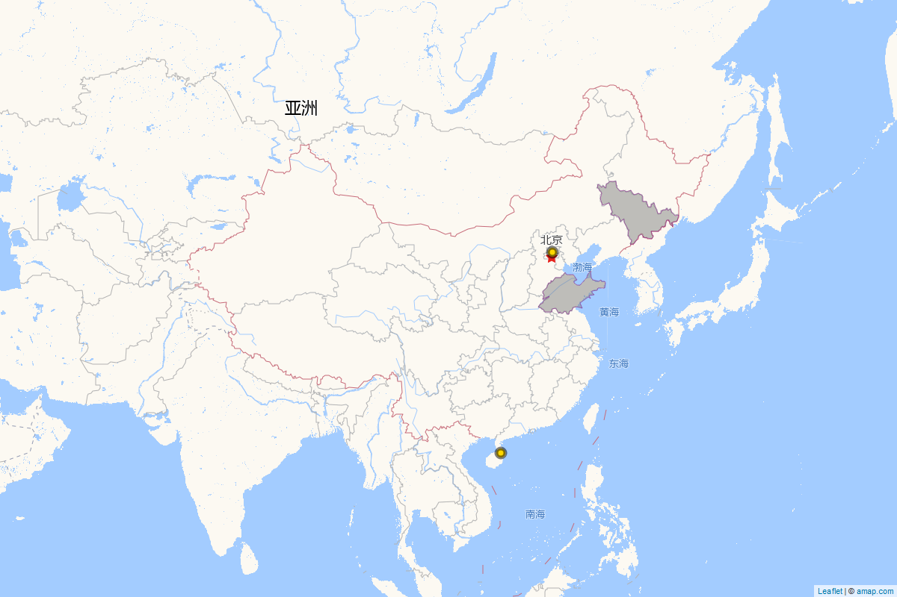

```{r setup, include=FALSE}
knitr::opts_chunk$set(message = FALSE, warning = FALSE)

if(!require(drhutools)) install.packages("drhutools")
library(drhutools)
```
# Installation

To install:

-  The latest released version: `install.packages("drhutools")`.
-  The latest developing version: `remotes::install_github("sammo3182/drhutools")`.


# Basic Usage of `goodChinaMap`

The "goodChinaMap" function allows users to generate a customized map of China. Users can input the Chinese character name of any provinces and cities, the highlight specific provinces with polygons, and cities with circle markers. Users can specify the color and border color for the provinces and cities on the map.

The following example demonstrates how to use the "goodChinaMap" function to highlight specific provinces and cities on a map of China.

library(drhutools)

goodChinaMap(
  province_data = c("吉林省", "山东省"), 
  city_data = c("北京", "海口"), 
  province_color = "grey", 
  province_border_color = "purple", 
  city_color = "black", 
  city_border_color = "gold"
)

In this example, the provinces of Jilin ("吉林省") and Shandong ("山东省") are highlighted in grey with purple borders polygons, while the cities of Beijing ("北京") and Haikou ("海口") are marked in black with gold borders circle markers.

The function returns the file path of the saved map image. The map is also saved as an HTML file for interactive viewing.

```{r out.width = '70%', echo = FALSE}

```

# Conclusion


# Affiliation
