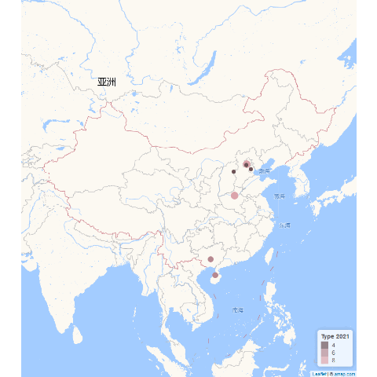

```{r setup, include=FALSE}
knitr::opts_chunk$set(
  message = FALSE,
  warning = FALSE
  # dpi = 300,
  # fig.dim = c(2.2, 2.5)
)

if (!require(dir2json)) remotes::install_github("stla/dir2json")

library(ggplot2)
library(dir2json)
library(drhutools)

# Functions preload
theme_set(theme_minimal())
set.seed(313)
```

# Efficient file organization: `folderSystem`

An efficient folder system can produce an organized environment for research and a smooth flow to pick up what you left from another moment. 
`folderSystem` provides a consistent folder categorization for a research project, especially, of empirical studies in social science. 

Once the function is called, it will create the folders shown as following in the working directory. 
In each folder, there is a short document indicating what it is suggested to be used.
Users are free to remove this illustration document after locating the real files in.
If the folders with the same name already exist in the directory, it would not be recreated or overwritten.

```{r foldersystem_setup, include=FALSE}
library(drhutools)

wd_original <- getwd()

# Create a temporary directory
temp_dir <- tempfile()
dir.create(temp_dir)
setwd(temp_dir)

folderSystem()
```

```{r folderSystem, eval=FALSE}
folderSystem()
```


```{r folderSystem_tree, echo=FALSE}
# Show the dendrogram of the folder structure using dir2tree
dir2tree(temp_dir) |>
  cat()
```

```{r folderSystem_resetwd, include=FALSE}
setwd(wd_original)
```


# Experimental result visulaization: `cdplot`

`cdplot` provides a function to compare the empirical cumulative distribution functions (ECDF) between the treatment and control groups in an experiment or quasi-experiment.
Comparing with conventional bar plots or difference-in-mean statistics, ECDF offers a fuller, non-parametric picture of the difference between treatment and control groups. 

The function will produce a `ggplot` object showing the entire distribution between the experimental groups.
The plot will show the ECDF of both the control and treatment groups.
It also identify with points and dash lines the value at which the treatment group is different from the control the most.
For multi-group experiment, the function will produce multiple plots for the comparison between the control group and each treatment.

Users should put experimental data into a "long" format storing the outcome in the first column and assignment in the second column.
The assign groups should be stored as levels of a factor.
The first category will be regarded as the control group.


Users can alter the argument in `point_size`, `point_color`, and `link_color` to customize the size of points and lines in the plot.
The function also provide the Kolmogorov-Smirnov test result between the control and treatment groups.
Users can set `ks_test` to `TRUE` to appear the result at the bottom-right corner of the plot.

The following example illustrates the results of an  experiment to compare yields (as measured by dried weight of plants) obtained under a control and two different treatment conditions, a dataset from @Dobson1983 and freely access by `datasets::PlantGrowh`.


```{r cdplot}
data("PlantGrowth")

plot_plant <- cdplot(PlantGrowth, ks_test = TRUE)
plot_plant
```

# Standard Map of China: `goodmap`

Drawing maps is more than often painful for Chinese scholars. 
The `goodmap` function is designed to draw national maps based on a template released by [Amap.com](https://ditu.amap.com/?amapexchange=%2F).
We were inspired by Dawei Lang's ([Lchiffon](https://github.com/Lchiffon)) excellent package [`leafletCN`](https://github.com/Lchiffon/leafletCN) and optimize `leafletCN::geojsonMap` to concentrate on drawing national maps. 
Moreover, we adopted [Yang Cao](https://caoyang.tech/)'s geodata [updated](https://github.com/Lchiffon/leafletCN/issues/12) in 2020 when drawing the map. 

The current version of `goodmap` enables users to draw points or fill polygons based on full names of prefectures or provinces, as illustrated in the following example.
For data does not have full city or provincial names, users can consider use tools such as [`regioncodes`](https://cran.r-project.org/web/packages/regioncode/index.html) to convert the data to the required format.
If `type = "polygon"`, the data frame should follow the exemplary structure below:

| id | city       | pro               | animate_set | variable   |
|----|--------------------------------|-------------|------------|
| 1  | 乌鲁木齐  | 新疆维吾尔自治区   | 2011        | 0.2861395  |
| 2  | 拉萨      | 西藏自治区         | 2011        | 0.3881083  |
| 3  | 呼和浩特  | 内蒙古自治区       | 2011        | 0.9466682  |
| 4  | 西宁      | 青海省             | 2012        | 0.8360043  |
| 5  | 成都      | 四川省             | 2012        | 0.4622928  |
| 6  | 哈尔滨    | 黑龙江省           | 2012        | 0.1387102  |


```{r polygon}
toy_map <- data.frame(
  id = c(1, 2, 3, 4, 5, 6),
  city = c("乌鲁木齐", "拉萨", "呼和浩特", "西宁", "成都", "哈尔滨"),
  prov = c("新疆维吾尔自治区", "西藏自治区", "内蒙古自治区", "青海省", "四川省", "黑龙江省"),
  animate_set = c(2010, 2010, 2010, 2011, 2011, 2011),
  variable = c(0.2861395, 0.3881083, 0.9466682, 0.8360043, 0.4622928, 0.1387102)
)

goodmap(
  toy_map,
  type = "polygon",
  level = "province"
)
```

Note: If users encounter errors or unreadable output, adjusting the encoding may help.

If `type = "point"`, the data frame should follow the exemplary structure below:

| name                                        | animate_set | g_lat      | g_lon       | g_pro          | g_city     | value_set |
|---------------------------------------------|-------------|------------|-------------|----------------|------------|-----------|
| 航天科技空间技术研究院展示中心              | 2021        | 39.947298  | 116.322434  | 北京市         | 北京市     | 8         |
| 长辛店二七纪念馆                            | 2021        | 39.830932  | 116.20602   | 北京市         | 北京市     | 4         |
| 天津觉悟社纪念馆                            | 2021        | 39.159621  | 117.196032  | 天津市         | 天津市     | 4         |
| 五台白求恩纪念馆（白求恩模范病室旧址）      | 2021        | 38.745234  | 113.58242   | 山西省         | 忻州市     | 4         |
| 中国中铁装备集团郑州盾构总装车间            | 2021        | 34.705527  | 113.755818  | 河南省         | 郑州市     | 8         |
| 昆仑关抗日战役纪念地                        | 2021        | 23.090849  | 108.685362  | 广西壮族自治区 | 南宁市     | 6         |
| 海南解放公园                                | 2021        | 20.008295  | 109.715334  | 海南省         | 临高县     | 6         |
| 南充市阆中红军烈士纪念园                    | 2017        | 31.564526  | 105.974878  | 四川省         | 南充市     | 5         |
| 厂窖惨案遇难同胞纪念馆                      | 2017        | 29.153561  | 112.248827  | 湖南省         | 益阳市     | 2         |
| 雅安市红军长征翻越夹金山纪念馆              | 2017        | 30.368317  | 102.811716  | 四川省         | 雅安市     | 4         |
| 中华苏维埃人民共和国川滇黔省革命委员会旧址  | 2017        | 27.302689  | 105.28199   | 贵州省         | 毕节市     | 4         |
| 抚顺雷锋纪念馆                              | 1997        | 41.850161  | 123.801936  | 辽宁省         | 抚顺市     | 9         |
| 杨靖宇烈士陵园                              | 1997        | 41.7295    | 125.962291  | 吉林省         | 通化市     | 5         |
| 瑷珲历史陈列馆                              | 1997        | 49.977569  | 127.493741  | 黑龙江省       | 黑河市     | 8         |
| 中国共产党第一次全国代表大会会址纪念馆      | 1997        | 31.220653  | 121.47536   | 上海市         | 上海市     | 4         |
| 河姆渡遗址博物馆                            | 1997        | 29.962122  | 121.349437  | 浙江省         | 宁波市     | 1         |
| 陶行知纪念馆                                | 1997        | 29.865772  | 118.436866  | 安徽省         | 黄山市     | 3         |

`goodmap` can also create animations to illustrate specified geographic dynamics. Users simply set `animate = TRUE` and specify the time variable for the function to draw the map accordingly.

```{r points}
toy_map <- data.frame(
  name = c("航天科技空间技术研究院展示中心", "长辛店二七纪念馆", "天津觉悟社纪念馆", 
           "五台白求恩纪念馆（白求恩模范病室旧址）", "中国中铁装备集团郑州盾构总装车间", 
           "昆仑关抗日战役纪念地", "海南解放公园", "南充市阆中红军烈士纪念园", 
           "厂窖惨案遇难同胞纪念馆", "雅安市红军长征翻越夹金山纪念馆", 
           "中华苏维埃人民共和国川滇黔省革命委员会旧址", "抚顺雷锋纪念馆", 
           "杨靖宇烈士陵园", "瑷珲历史陈列馆", "中国共产党第一次全国代表大会会址纪念馆", 
           "河姆渡遗址博物馆", "陶行知纪念馆"),
  animate_set = c(2021, 2021, 2021, 2021, 2021, 2021, 2021, 2017, 2017, 2017, 2017, 
               1997, 1997, 1997, 1997, 1997, 1997),
  g_lat = c(39.947298, 39.830932, 39.159621, 38.745234, 34.705527, 23.090849, 
            20.008295, 31.564526, 29.153561, 30.368317, 27.302689, 41.850161, 
            41.7295, 49.977569, 31.220653, 29.962122, 29.865772),
  g_lon = c(116.322434, 116.20602, 117.196032, 113.58242, 113.755818, 108.685362, 
            109.715334, 105.974878, 112.248827, 102.811716, 105.28199, 123.801936, 
            125.962291, 127.493741, 121.47536, 121.349437, 118.436866),
  g_pro = c("北京市", "北京市", "天津市", "山西省", "河南省", "广西壮族自治区", 
            "海南省", "四川省", "湖南省", "四川省", "贵州省", "辽宁省", 
            "吉林省", "黑龙江省", "上海市", "浙江省", "安徽省"),
  g_city = c("北京市", "北京市", "天津市", "忻州市", "郑州市", "南宁市", "临高县", 
             "南充市", "益阳市", "雅安市", "毕节市", "抚顺市", "通化市", 
             "黑河市", "上海市", "宁波市", "黄山市"),
  value_set = c(8, 4, 4, 4, 8, 6, 6, 5, 2, 4, 4, 9, 5, 8, 4, 1, 3)
)
goodmap(
  toy_map,
  type = "point",
  animate = TRUE,
  animate_var = "animate_set",
  custom_colors = "pink",
  base_radius = 1,
  radius_factor = 1
)

```

# Color blind friendly palette

Everyone has their favorite colors. 
This package provides a palette that I personally like and use all the time. 
The primary colors are gold (#FFCD00) and black (#000000).
So the palette is named as `_gb`. 

Users can use the palette as any other palettes when visualizing with `ggplot2`.
All the above visualizing elements are drawn with this palette. 
An extra example with codes are shown below to illustrate how users can use it.

```{r gb}
ggplot(mtcars, aes(wt, mpg, color = cyl)) +
  geom_point() +
  scale_color_gb(discrete = FALSE)

ggplot(mpg, aes(y = class, fill = drv)) +
  geom_bar() +
  scale_fill_gb()
```

Except for the primary palette (named as `main`), users are given four alternatives with more color options, as following.

- `tricol`: Gold, black, and dark grey to create a gradual effect.
- `digitMixed`: Five-pack colors specified for digital publications.
- `printMixed`: Five-pack colors specified for printed publications.
- `full`: A palette including all the colors gb_cols can call.

I would actually like to open this function to my users for adding your favorite palette, as long as you give them a special name and a list of colors.


# Psychological scale scoring: `traits`

`traits` is used for calculating personality traits based on psychological surveys.
The current version can calculate the TOSCA-3SC scores and Grit-O score.
The TOSCA-3SC (Test of Self-Conscious Affect—Short Version) is created by @Tangney1990 for measuring self-conscious emotions, particularly *shame* and *guilt* []. 
Participants are presented with hypothetical scenarios, and their responses are analyzed to assess the intensity of shame or guilt reactions. 
The Grit-O scale is created by @DuckworthEtAl2007 to measure *grit*, which refers to an individual's perseverance and passion for long-term goals.

Users need to fit the survey data with specific column names as illustrated below: 

- TOSCA-3SC: `Q3|R3` ~ `Q13|R4`
- Grit-O: `Q14|1` ~ `Q25|1`

```{r traits}
column_names <- c(
  "Q3|R3", "Q3|R4", "Q4|R3", "Q4|R4", "Q5|R5", "Q5|R6", "Q6|R3", "Q6|R4", "Q7|R3",
  "Q7|R4", "Q8|R5", "Q8|R6", "Q9|R5", "Q9|R6", "Q10|R5", "Q10|R6", "Q11|R5", "Q11|R6", "Q12|R3",
  "Q12|R4", "Q13|R3", "Q13|R4", "Q14|1", "Q15|1", "Q16|1", "Q17|1", "Q18|1", "Q19|1", "Q20|1",
  "Q21|1", "Q22|1", "Q23|1", "Q24|1", "Q25|1"
)

toy_data <- data.frame(matrix(sample(1:5, 10 * length(column_names), replace = TRUE),
  ncol = length(column_names)
))

names(toy_data) <- column_names

traits(toy_data)
```


# Affiliation

Yue Hu

Department of Political Science,

Tsinghua University, 

Email: <yuehu@tsinghua.edu.cn>

Website: <https://www.drhuyue.site>

<br>

Wen Deng

College of Public Administration,

Huazhong University of Science and Technology,

Email: <dengwenjoy@outlook.com>

## References
